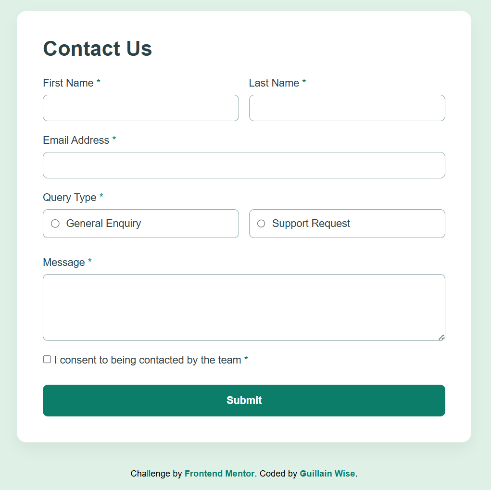

# Frontend Mentor - Contact form solution

This is a solution to the [Contact form challenge on Frontend Mentor](https://www.frontendmentor.io/challenges/contact-form--G-hYlqKJj). Frontend Mentor challenges help you improve your coding skills by building realistic projects. 

## Table of contents

- [Overview](#overview)
  - [The challenge](#the-challenge)
  - [Screenshot](#screenshot)
  - [Links](#links)
- [My process](#my-process)
  - [Built with](#built-with)
  - [What I learned](#what-i-learned)
  - [Continued development](#continued-development)
  - [Useful resources](#useful-resources)
- [Author](#author)

## Overview

This project is a modern, responsive contact form built as part of a Frontend Mentor challenge. The goal is to create a user-friendly interface with real-time validation and a clean aesthetic while ensuring high accessibility standards and a mobile-first approach.

### The challenge

Users should be able to:

- Complete the form and see a success toast message upon successful submission
- Receive form validation messages if:
  - A required field has been missed
  - The email address is not formatted correctly
- Complete the form only using their keyboard
- Have inputs, error messages, and the success message announced on their screen reader
- View the optimal layout for the interface depending on their device's screen size
- See hover and focus states for all interactive elements on the page

### Screenshot



### Links

- Solution URL: [Frontend Mentor Solution]()
- Live Site URL: [Live Demo]()

## My process

### Built with

- Semantic HTML5 markup
- CSS custom properties
- Flexbox
- CSS Grid (for form row layout)
- Mobile-first workflow
- Vanilla JavaScript for form validation

### What I learned

During this project, I focused on creating a robust form validation system using Vanilla JavaScript. I also experimented with the CSS `:has()` selector to style the parent radio card when its child radio button is checked.

Code snippet for the `:has()` selector usage:
```css
.radio-card:has(input:checked) {
  background-color: var(--green-200);
  border-color: var(--green-600);
}
```

Snippet for the email validation logic:
```js
const emailPattern = /^[^\s@]+@[^\s@]+\.[^\s@]+$/;
if (!emailPattern.test(email.value)) { 
  email.parentElement.classList.add('error'); 
  isValid = false; 
}
```

### Continued development

In future projects, I want to explore more advanced accessibility (ARIA) attributes and perhaps implement more complex multi-step forms using modern frameworks like React or Next.js.

### Useful resources

- [MDN Web Docs - Form Validation](https://developer.mozilla.org/en-US/docs/Learn/Forms/Form_validation) - This is a great resource for understanding native and custom form validation.
- [CSS-Tricks - The :has() Selector](https://css-tricks.com/the-has-selector-is-here/) - Helped me understand how to style parent elements based on child state.

## Author


- Frontend Mentor - [@GuillainWise](https://www.frontendmentor.io/profile/GuillainWise)


## Acknowledgments

Thanks to Frontend Mentor for providing high-quality design files and challenges that help developers grow.
